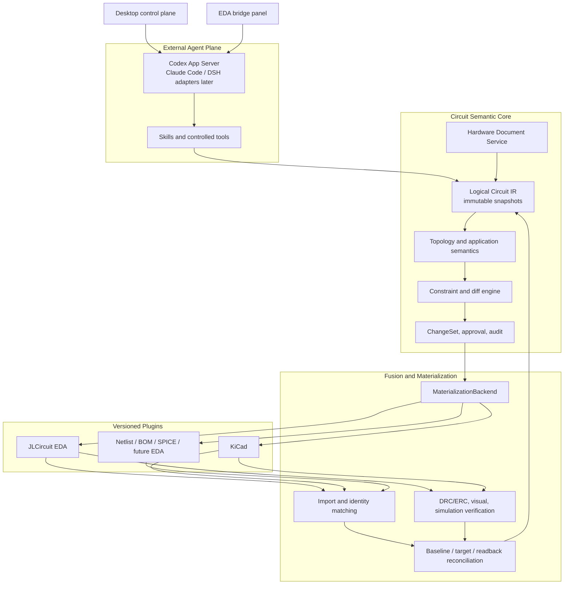

# CircuitFabric Architecture

[简体中文](architecture.zh-CN.md)

## 1. Positioning

CircuitFabric is the semantic and materialization substrate for AI-assisted circuit design. It is deliberately not an LLM wrapper and not an EDA-specific extension. External agents reason over curated context and controlled tools; CircuitFabric owns circuit facts, evidence, change control, materialization, and verification.

The first target backend is JLCircuit EDA. It is a plugin implementation, not the domain model or the system of record for every layer.

## 2. Architecture



## 3. Ownership and write boundaries

| Layer | Owns | Allowed writers | Must not do |
| --- | --- | --- | --- |
| External agent runtime | Reasoning, explanations, candidate plans | Runtime adapter | Treat model output as a design fact or call raw EDA APIs |
| Hardware Document Service | Authorized documents, extracted evidence, citations | Document ingestion and user-confirmed metadata | Promote unsupported model memory to evidence |
| Circuit Semantic Core | Logical Circuit IR, semantic facts, constraints, snapshot lineage | Importer, deterministic validators, approved IR patches | Store backend-only primitive IDs as logical identity |
| Fusion layer | Identity mapping, conflicts, reconciliation | Import/fusion services | Silently overwrite EDA or logical state |
| Materialization backend | Backend operation plan, execution and rollback handles | Specific backend plugin | Mutate Logical IR directly |
| Desktop control plane | Projects, documents, service lifecycle, agent/MCP configuration, audit, usage, semantic queries, BOM export | User actions and service | Own the authoritative circuit state or provide the EDA chat surface |
| EDA backend/bridge plugin | EDA-local chat surface, current-design observation, scoped task/session interaction, backend operations | Specific backend plugin | Store API keys, manage global documents/MCPs, or mutate Logical IR directly |

## 4. Semantic data model

The core uses immutable, content-addressed snapshots.

```text
LogicalCircuitSnapshot
  schemaVersion
  snapshotHash
  logicalHash                 # topology and semantic facts only
  physicalHash?               # backend-specific physical observation
  parentSnapshotHash?
  authority                   # observed | planned | verified
  components / pins / nets / buses / interfaces
  application semantics
  constraints and validation results
  evidence references
```

`logicalHash` must remain stable when only placement, rotation, wire geometry, or labels change. `physicalHash` may change for those operations. A logical ID is never derived solely from a JLCircuit/KiCad primitive ID.

Every fact and validation result has a source, timestamp, and one of `passed`, `failed`, `inconclusive`, or `not_run`. Missing readback is always `inconclusive`.

## 5. External agent runtime boundary

An `AgentRuntime` adapter normalizes a runtime's session, turn, streaming, tool-call, usage, cancellation, and approval events into CircuitFabric events.

The adapter receives:

- a bounded task context and referenced semantic snapshots;
- selected skills and explicitly allowed tools;
- document evidence and citations from the session's project, plus a scoped source-aware document retrieval tool; it never receives unrestricted filesystem access;
- a request-scoped permission policy.

The adapter returns candidate `IRPatch` objects, explanations, clarification requests, and tool requests. It never owns the canonical conversation-to-design mapping, persistent IR, backend credentials, or EDA bridge. EDA-originated sessions use the same adapter contract: their `projectId`, session identity, selected runtime configuration, permitted MCP/skills, and document scope are resolved by CircuitFabric before the runtime starts.

Codex App Server is the first runtime adapter. Claude Code, DSH, and other runtimes are supported only after their thread, streaming, dynamic tool, and approval semantics are mapped to this contract.

## 6. Hardware Document Service

The document service manages explicitly authorized sources: datasheets, errata, reference circuits, component libraries, BOMs, netlists, application notes, and project notes.

Each indexed document stores a source identifier, relative locator, content hash, version/modified metadata, extracted fragments, and citations such as page, table, line, or image region. The service exposes source-aware retrieval. It does not permit an agent to browse arbitrary local paths.

Evidence is referenced from IR components, constraints, application semantics, and verification reports. An EDA chat session may query only documents authorized for its project; retrieval returns extracted fragments together with immutable source/content references and locators. The runtime must attach those references when it makes a document-derived claim, and the resulting citation is persisted in the session/audit record. Document-derived facts may be challenged or superseded, but the source lineage remains append-only.

## 7. Fusion and materialization

An EDA write is a four-step protocol:

1. `inspect`: import a backend observation as `observed` IR.
2. `preview`: turn a validated `IRPatch` into a backend-specific `MaterializationPlan`.
3. `apply`: execute an approved plan and preserve compensation/rollback data.
4. `readback`: import the backend again, then reconcile baseline, target, and observed snapshots.

Verification combines deterministic topology checks, native DRC/ERC, optional visual evidence, and optional simulation. Apply success and verification success are separate states.

## 8. Plugin model

Plugins are versioned packages with declarative metadata. Two kinds are initially supported:

- `agent-runtime`: connects an external reasoning runtime to the normalized Agent Runtime contract.
- `eda-backend`: implements import, preview, apply, readback, rollback, and verification capabilities for one design system.

An `eda-backend` may also ship a `bridge-ui` entry point for its host EDA. That entry point supplies the EDA-local conversation panel and current-design context capture; it talks only to CircuitFabric's project-scoped bridge protocol. The desktop control plane owns project setup, document management, runtime/API-key configuration, MCP/skill policy, and global task/usage views.

The first manifest format is intentionally declarative:

```json
{
  "manifestVersion": 1,
  "id": "jlcircuit-eda",
  "kind": "eda-backend",
  "apiVersion": "circuitfabric-plugin/v1",
  "transport": "bridge",
  "capabilities": ["inspect", "preview", "apply", "readback", "rollback", "drc", "visual-capture", "bridge-chat", "bridge-context"]
}
```

Manifest discovery must not execute code. Installation, signature verification, process isolation, network/file permissions, and lifecycle supervision are separate responsibilities of the Plugin Host.

The first JLCircuit backend/bridge is an independent implementation in this repository. JLCircuit-Agent may be used to derive observable workflow requirements and compatibility fixtures, but CircuitFabric must neither import it, link against it, nor copy its implementation. Its bridge protocol and UI belong to this backend plugin, not to the desktop control plane.

## 9. Storage

The initial storage model has distinct stores or tables for:

- immutable logical and physical snapshots;
- external-object identity mappings and reconciliation outcomes;
- ChangeSets, approvals, execution attempts, rollback handles, and verification reports;
- document sources, extracted fragments, citations, and evidence packages;
- runtime sessions, task summaries, usage, and event traces;
- plugin manifests, version locks, permission grants, and health status.
- projects, authorized document bindings, agent/runtime configuration versions, enabled skill/MCP grants, session-to-project mappings, and usage aggregates.

Only snapshot/ChangeSet identifiers cross service boundaries. No service reads a global mutable "current circuit" object.

## 10. Security invariants

- Agents cannot directly write to an EDA, filesystem, document source, or plugin process.
- High-risk materialization requires a user approval bound to a base snapshot and plan hash.
- A plan is rejected if its base snapshot no longer matches current observed state.
- Credentials are held by the service or a secret store, never included in agent context or plugin manifests.
- A plugin gets only the minimum backend, document, filesystem, and network permissions it declares and the user approves.
- API keys are stored by CircuitFabric's secret store and are never exposed to an EDA bridge plugin or written into a plugin manifest.

## 11. Desktop control plane and EDA bridge workflow

The desktop UI is an engineering control plane, not a second schematic editor or a second chat client. Its initial screens manage projects; authorized PDF, Word, and Markdown documents; EDA service/bridge health; runtime endpoints and API-key references; skill and MCP grants; sessions/tasks/audit; usage; semantic queries; and BOM export.

Users converse with the agent in the host EDA's bridge panel. On session start, the bridge identifies the project and EDA observation, while CircuitFabric resolves the runtime configuration and provides project-authorized document retrieval. The bridge forwards conversation and task events for centralized audit and presents task progress locally. The desktop UI can replay those sessions, but does not create a competing EDA chat workflow.
