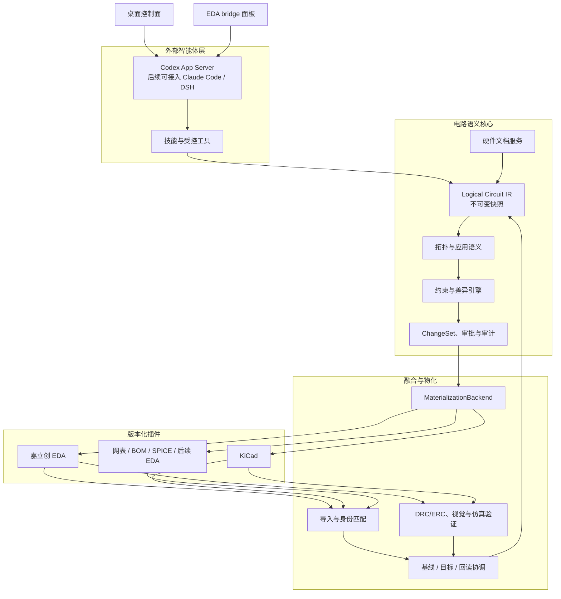

# CircuitFabric 架构

[English](architecture.md)

## 1. 定位

CircuitFabric 是 AI 辅助电路设计的语义与物化底座。它刻意不是 LLM 包装器，也不是某个 EDA 的专属扩展。外部智能体在经过筛选的上下文和受控工具上进行推理；CircuitFabric 拥有电路事实、证据、变更控制、物化和验证。

首个目标后端是嘉立创 EDA。它只是一个插件实现，不是各层领域模型，更不是整个系统的事实来源。

## 2. 架构



## 3. 所有权与写入边界

| 层 | 拥有内容 | 允许写入者 | 禁止事项 |
| --- | --- | --- | --- |
| 外部智能体运行时 | 推理、解释、候选计划 | 运行时适配器 | 将模型输出视为设计事实，或调用原始 EDA API |
| 硬件文档服务 | 已授权文档、提取证据、引用 | 文档摄入和用户确认的元数据 | 将无证据的模型记忆升级为证据 |
| 电路语义核心 | Logical Circuit IR、语义事实、约束、快照谱系 | 导入器、确定性校验器、已批准的 IR 补丁 | 将后端专属图元 ID 用作逻辑身份 |
| 融合层 | 身份映射、冲突、协调结果 | 导入/融合服务 | 静默覆盖 EDA 或逻辑状态 |
| 物化后端 | 后端操作计划、执行及补偿/回滚句柄 | 特定后端插件 | 直接修改 Logical IR |
| 桌面控制面 | 项目、文档、服务生命周期、智能体/MCP 配置、审计、用量、语义查询、BOM 导出 | 用户操作和服务 | 拥有权威电路状态，或提供 EDA 内对话入口 |
| EDA backend/bridge 插件 | EDA 本地对话界面、当前设计观测、范围受限的任务/会话交互、后端操作 | 特定后端插件 | 保存 API Key、管理全局文档/MCP，或直接修改 Logical IR |

## 4. 语义数据模型

核心使用不可变、内容寻址的快照。

```text
LogicalCircuitSnapshot
  schemaVersion
  snapshotHash
  logicalHash                 # 仅拓扑与语义事实
  physicalHash?               # 后端专属的物理观测
  parentSnapshotHash?
  authority                   # observed | planned | verified
  components / pins / nets / buses / interfaces
  application semantics
  constraints and validation results
  evidence references
```

仅改变位置、旋转、导线几何或标签时，`logicalHash` 必须保持稳定；`physicalHash` 可变化。逻辑 ID 绝不能仅由嘉立创/KiCad 的图元 ID 推导。

每项事实与校验结果都带有来源、时间戳，并且状态为 `passed`、`failed`、`inconclusive` 或 `not_run` 之一。缺失回读始终是 `inconclusive`。

## 5. 外部智能体运行时边界

`AgentRuntime` 适配器将运行时的会话、轮次、流式输出、工具调用、用量、取消和审批事件标准化为 CircuitFabric 事件。

适配器接收：

- 有界的任务上下文和引用的语义快照；
- 已选技能和明确允许的工具；
- 来自会话项目的文档证据与引用，以及受范围约束、按来源检索文档的工具；它绝不会获得不受限制的文件系统访问；
- 请求范围内的权限策略。

适配器返回候选 `IRPatch`、解释、澄清请求和工具请求。它不拥有会话到设计的权威映射、持久 IR、后端凭据或 EDA bridge。EDA 发起的会话使用相同适配器契约：CircuitFabric 在启动运行时前解析其 `projectId`、会话身份、已选运行时配置、获准 MCP/技能与文档范围。

Codex App Server 是第一个运行时适配器。Claude Code、DSH 和其他运行时仅在其线程、流式、动态工具与审批语义映射到本契约后才支持。

## 6. 硬件文档服务

文档服务管理经明确授权的来源：数据手册、勘误、参考电路、元件库、BOM、网表、应用笔记和项目说明。

每个已索引文档保存来源标识符、相对定位符、内容哈希、版本/修改元数据、提取片段，以及页、表、行或图像区域等引用。服务提供按来源的检索，不允许智能体浏览任意本地路径。

IR 元件、约束、应用语义与验证报告都可引用证据。EDA 对话会话只能查询其项目已授权文档；检索返回提取片段以及不可变的来源/内容引用和定位符。运行时生成文档派生结论时必须附带这些引用，最终引用持久化到会话/审计记录。文档派生事实可以被质疑或替代，但来源谱系保持追加式记录。

## 7. 融合与物化

一次 EDA 写入采用四步协议：

1. `inspect`：将后端观测导入为 `observed` IR。
2. `preview`：把已校验的 `IRPatch` 转为后端专属的 `MaterializationPlan`。
3. `apply`：执行已批准计划，并保留补偿/回滚数据。
4. `readback`：再次导入后端，再协调基线、目标和观测快照。

验证综合确定性拓扑检查、原生 DRC/ERC、可选视觉证据和可选仿真。写入执行成功与验证成功是不同状态。

## 8. 插件模型

插件是带声明式元数据的版本化包。初始支持两类：

- `agent-runtime`：将外部推理运行时连接到标准化的 Agent Runtime 契约。
- `eda-backend`：为某一设计系统实现导入、预览、应用、回读、回滚与验证能力。

`eda-backend` 可为其宿主 EDA 一并提供 `bridge-ui` 入口。该入口提供 EDA 本地对话面板和当前设计上下文采集；它只能与 CircuitFabric 的项目范围 bridge 协议通信。项目设置、文档管理、运行时/API Key 配置、MCP/技能策略及全局任务/用量视图由桌面控制面拥有。

首个 manifest 格式刻意保持声明式：

```json
{
  "manifestVersion": 1,
  "id": "jlcircuit-eda",
  "kind": "eda-backend",
  "apiVersion": "circuitfabric-plugin/v1",
  "transport": "bridge",
  "capabilities": ["inspect", "preview", "apply", "readback", "rollback", "drc", "visual-capture", "bridge-chat", "bridge-context"]
}
```

Manifest 发现不得执行代码。安装、签名验证、进程隔离、网络/文件权限和生命周期监管是 Plugin Host 的独立职责。

第一个嘉立创 backend/bridge 在本仓库中独立实现。JLCircuit-Agent 可用于提取可观测工作流要求与兼容性夹具，但 CircuitFabric 不得导入、链接或复制它的实现。其 bridge 协议和 UI 属于该后端插件，而非桌面控制面。

## 9. 存储

初始存储模型至少包含以下独立存储或表：

- 不可变的逻辑和物理快照；
- 外部对象身份映射与协调结果；
- ChangeSet、审批、执行尝试、回滚句柄和验证报告；
- 文档来源、提取片段、引用和证据包；
- 运行时会话、任务摘要、用量和事件轨迹；
- 插件 manifest、版本锁、权限授予和健康状态；
- 项目、已授权文档绑定、智能体/运行时配置版本、已启用技能/MCP 授权、会话到项目的映射和用量汇总。

只有快照/ChangeSet 标识符可跨服务边界传递。任何服务均不读取全局可变的“当前电路”对象。

## 10. 安全不变量

- 智能体不能直接写入 EDA、文件系统、文档来源或插件进程。
- 高风险物化必须获得绑定基线快照和计划哈希的用户审批。
- 当计划基线快照不再匹配当前观测状态时，必须拒绝该计划。
- 凭据由服务或密钥存储保管，绝不放入智能体上下文或插件 manifest。
- 插件只获得其声明且用户批准的最小后端、文档、文件系统和网络权限。
- API Key 存储于 CircuitFabric 的密钥存储，绝不暴露给 EDA bridge 插件或写入插件 manifest。

## 11. 桌面控制面与 EDA bridge 工作流

桌面 UI 是工程控制面，不是第二个原理图编辑器，也不是第二个对话客户端。其初始页面管理项目；已授权的 PDF、Word 和 Markdown 文档；EDA 服务/bridge 健康度；运行时端点和 API Key 引用；技能与 MCP 授权；会话/任务/审计；用量；语义查询；以及 BOM 导出。

用户在宿主 EDA 的 bridge 面板中与智能体对话。会话开始时，bridge 标识项目和 EDA 观测；CircuitFabric 解析运行时配置并提供已获项目授权的文档检索。bridge 为集中审计转发对话与任务事件，并在本地呈现任务进度。桌面 UI 可以回放这些会话，但不会创建相互竞争的 EDA 对话流程。
