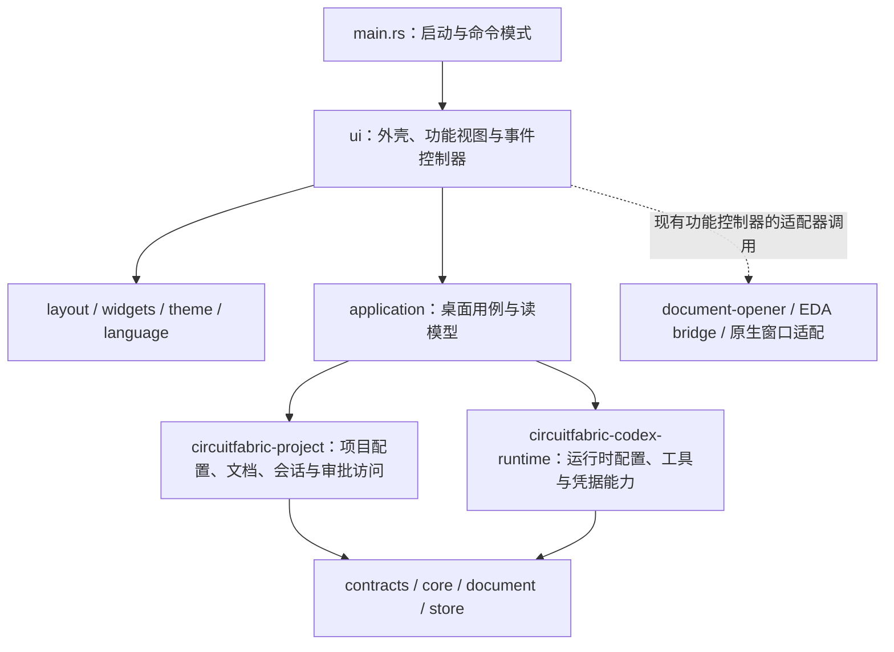

## 原始需求

当前已陆陆续续实现了不少功能和界面，但每一个功能模块都是单独实现的，没有对界面、业务功能逻辑和数据做很好的分层，所以要修改一个界面上特性，比如之前的显示区域超出后没有滚动条的问题，需要分别在各处修改；帮我梳理一下代码，做一些分层的设计，并抽象出一些通用的概念和界面特征，让代码结构更合理化，并把修改后的架构设计写到这个任务的描述里，尽量详尽。

## 本次重构的范围与结果

2026-10-03，任务 TASK-5-16（491）。本设计描述仓库中已经落地的桌面端结构，并单独列出后续演进方向。产品总体架构仍以 `docs/architecture.zh-CN.md` 为准：CircuitFabric 的语义事实、文档证据、审批和物化边界独立于 GPUI、Codex 和具体 EDA 产品。

本次聚焦最集中的耦合点：`apps/circuitfabric-desktop/src/main.rs` 原有 16,160 行，绝大多数桌面类型、服务编排和渲染代码局部定义在 `main()` 中；工具管理的 1,077 行代码通过 `include!` 和宏展开进入相同作用域。重构后 `main.rs` 为 27 行，只负责命令模式和桌面启动。原有功能迁入正常 Rust 模块，工具管理不再使用宏注入。

实际落地的行为改进：

- 页面滚动、独立面板滚动、页面间距与主题颜色有明确的公共维护入口。
- 普通滚动区域统一显示组件库滚动条，使用显式稳定 ID 保存位置，不再依赖公共辅助函数的调用位置生成 ID。
- 流式页面由外壳承担一次主滚动；固定工作区由内部列表、详情承担滚动，移除外壳与页面重复滚动。
- 项目文档、完整性检查、会话、语义快照、ChangeSet 的读模型加载有单一实现；刷新全部成功后才替换旧缓存。
- 项目读模型刷新成功后使使用量/审计缓存失效，避免继续显示刷新前的投影。
- 语义查询和哈希摘要离开 GPUI，可直接做无窗口测试；异常的非 ASCII 哈希文本不再因按字节截断而导致崩溃。
- CI 增加桌面应用层测试和分层/滚动边界检查。本地另有实际 GPUI 布局和滚轮事件测试。

领域契约、持久文件格式、EDA bridge 协议、凭据规则与审批语义保持兼容。此次没有新增持久化迁移。

## 一、代码现状与问题定位

| 原问题 | 具体表现 | 本次处理 |
| --- | --- | --- |
| 入口承载全部功能 | `main()` 内定义视图、数据类型、异步回调和页面；修改入口几乎影响所有功能 | 入口、应用层、公共 UI、功能 UI 分开 |
| 滚动规则分散 | 大量 `.overflow_y_scroll()` 只支持滚动，没有滚动条；主容器与页面重复滚动 | 公共 `ScrollRegionExt`、`page_host` 和两种页面布局 |
| 数据读取混在视图 | 挂载项目和刷新项目重复读取相同的文档/会话/快照/ChangeSet | `application/project_data.rs` 统一加载 |
| 刷新可发布半份数据 | 先更新文档和快照，再读取 ChangeSet；末尾失败时缓存已经改变 | 先构造完整 `ProjectWorkspaceData`，再一次插入缓存 |
| 纯查询绑定窗口 | 语义检索是 `ControlPlaneView` 的方法，只有 native-ui 下可编译 | 独立 `semantic_query` 应用查询模块 |
| 公共控件依附巨型视图 | 字段、空态、详情容器通过 `Self::...` 使用，表面上属于业务视图 | `widgets.rs` 的无状态函数，不接收整个视图 |
| 宏隐藏模块关系 | 工具管理依赖宏调用处所有局部名称 | 普通 `ui/tools.rs`，由编译器检查模块可见性 |

已有分层也应保留：`contracts`、`core`、`store`、`project`、`document`、`document-opener`、`plugin-api` 已承担不同职责。本次不为“看起来更分层”而重新包装所有 crate，也没有引入全局服务定位器或通用仓储框架。

## 二、分层结构与依赖方向



| 层 | 代码位置 | 拥有的内容 | 约束 |
| --- | --- | --- | --- |
| 启动层 | `src/main.rs`、`ui::run` | judge 命令分流、GPUI 初始化、窗口/资源装配 | 不放页面布局和领域算法 |
| 表现层 | `src/ui/` | GPUI 元素、输入控件、选择、弹窗、图片、焦点、事件连接 | 不把 UI 状态变为权威电路状态 |
| 公共表现组件 | `ui/layout.rs`、`widgets.rs`、`theme.rs`、`language.rs` | 滚动、尺寸收缩、间距、颜色、通用字段、空态与语言 | 不读取项目文件，不接收整个 `ControlPlaneView` |
| 应用层 | `src/application/` | 桌面导航状态、配置用例、项目读模型、语义查询、使用量/审计投影、插件治理 | 不依赖 GPUI；输入输出使用普通 Rust 值和领域类型 |
| 项目服务与领域层 | `crates/circuitfabric-project` 等 | 项目范围、证据授权、逻辑快照、会话和审批规则 | 不反向依赖桌面 UI |
| 外部能力适配层 | runtime、document-opener、plugins、原生平台模块 | 进程、文件格式、凭据、EDA 通信、窗口系统 | 适配外部实现，不取代语义事实和审批边界 |

这里的 `application` 是桌面产品用例层，不是所有领域规则的新归属。跨桌面、bridge、CLI 复用的规则仍应放在相应服务 crate；桌面独有的只读投影可以留在应用层。

应用层目前使用已有具体服务 API。没有仅为抽象而为每次文件读取定义 trait。以后出现第二种持久实现、远程项目或需要替换适配器测试时，再在实际变化点引入端口。

## 三、目录与职责

以下路径以 `apps/circuitfabric-desktop/src/` 为根：

```text
main.rs                         启动分流
application/
  mod.rs                        无 UI 依赖的应用模块边界
  navigation.rs                 页面元数据、项目选择、窗口标题
  project_data.rs               项目恢复、挂载、完整读模型加载和刷新
  semantic_query.rs             指定类型的只读语义查询、哈希摘要
  settings_persistence.rs       配置分区保存与已保存快照
  project_runtime.rs            从项目根目录生成运行时启动配置
  usage_audit.rs                用量聚合、审计筛选与导出投影
  plugin_governance.rs           manifest 发现、权限/信任和治理记录
ui/
  mod.rs                        原生装配入口与内部公共依赖
  bootstrap.rs                  控件、草稿和资源初始化
  state.rs                      表现状态和原生资源生命周期
  shell.rs                      侧栏、页头、状态栏、页面路由、预览分栏
  layout.rs                     页面/面板布局与统一滚动策略
  widgets.rs                    字段、提示、详情容器、空态、键值行
  theme.rs                      语义颜色和深浅色解析
  language.rs                   语言选择与导航文案
  projects.rs                   项目页面和项目相关事件
  documents.rs                  预览打开、提取与关闭控制
  evidence.rs                   文档检索与来源定位界面/事件
  preview.rs                    PDF/表格/文本/结构化数据预览
  sessions.rs                   会话列表和回放界面
  runtime.rs                    运行时与 EDA 服务页面及生命周期事件
  authorization.rs              UI 授权操作和有效权限选择
  settings.rs                   设置与 Provider/运行时表单
  tools.rs                      技能/MCP 列表、详情与编辑事件
  jev.rs                        Jev 配置、校验与交互
  secrets.rs                    保险库交互与页面
  plugins.rs                    插件治理页面和事件
  semantics.rs                  语义查询结果展示
  changes.rs                    ChangeSet 和审批展示/操作
  export.rs                     导出页面与用户交互
  usage.rs                      用量/审计页面、缓存接入和导出交互
  overview.rs                    总览页面
  commands.rs                    命令面板与快捷键
pdf_zoom.rs                     可无窗口测试的缩放运动计算
pdf_text_layer.rs               GPUI 文本选择与剪贴板集成
pdf_cursors.rs / windows_icon.rs Windows 平台适配，局部 unsafe 边界
```

功能文件采用垂直切分：同一功能的渲染和事件接线在一起，应用查询、公共组件和领域服务横向复用。这样定位功能改动不必在十几个通用目录里来回寻找。

`ControlPlaneView` 仍是一个 GPUI 根 Entity；功能模块的方法通过 `pub(super)` 在 UI 子树内部协作，不作为整个应用的公共服务 API。它仍保存多数历史 UI 状态，且部分复杂异步编排仍位于功能控制器中；这次不是把全部功能一次性改造成独立 Entity 的大改写。

## 四、核心概念与数据所有权

### 1. 权威事实、读模型、编辑草稿、表现状态

| 概念 | 示例 | 更新方式 |
| --- | --- | --- |
| 权威事实 | 持久化项目配置、文档索引、不可变逻辑快照、会话/审批记录 | 已有服务 API 校验并持久化 |
| 读模型 | `ProjectWorkspaceData`、`UsageAuditModel`、`SemanticQueryHit` | 从事实构造，可丢弃、重建；不直接回写为事实 |
| 编辑草稿 | Provider 输入框、Jev 表单、目录编辑器 | 用户编辑只改变草稿；明确保存动作才提交 |
| 表现状态 | `DesktopShell`、当前页、已选项目、弹窗、焦点、滚动与预览宽度 | UI 控制器维护，不改变电路快照 |
| 运行资源 | 进程句柄、取消令牌、图像、滚动锚点、解锁 vault | 有明确生命周期，不进入持久读模型 |

`DesktopShell` 现在实际承载根视图的页面和项目选择，而不是一个仅用于测试的壳类型。项目选择只是桌面上下文；不得将其解释为“可由任意模块写入的当前电路”。领域操作仍显式携带项目 ID 或快照身份。

### 2. ProjectWorkspaceData

每个项目的可展示快照包括：

- 文档目录及授权/扫描状态；
- 按文档 ID 缓存的内容完整性判断；
- 会话列表和读取诊断；
- 逻辑快照列表；
- ChangeSet 列表。

`ProjectWorkspaceData::load` 是这些数据的统一读取入口。挂载和刷新复用它，避免不同页面形成不同的读取口径。文档哈希检查发生在加载阶段，渲染只读缓存，不在每帧重新读取和校验文件。

`refresh_project_data` 的内存发布边界是整份项目读模型：先读取所有字段，任何一步失败都返回错误，旧缓存保持不变；全部成功才替换目标项目条目。该保证不等于底层多个文件组成了数据库事务；外部进程同时写入时仍服从现有文件服务的语义。项目挂载/证据恢复也不是本次新建的跨服务事务。

### 3. SettingsUpdate

`settings_persistence::save_update` 保留按配置分区提交的模型：读取最新持久配置，只合并本次修改，验证并保存后返回新快照。不能把另一个页面尚未保存的 Provider 或工具草稿一起写入。

“保存配置”“启用定义”“授予权限”“连接服务”仍然是不同动作。UI 应分别呈现它们；通用组件不应合并这些业务含义。

### 4. 查询与命令

查询不产生领域写入，例如 `semantic_query_hits(snapshot, scope, query)`；`scope` 显式区分元件、引脚、网络、约束和证据，结果只是展示投影。保留来源定位符和证据关联，不能把查询命中升级为验证通过。

命令负责验证、持久化及错误反馈，例如配置保存、项目文档导入、审批记录。控件事件收集用户意图，随后调用应用/领域服务。新功能不应在 `render_*` 内执行持久写入或启动外部任务。

## 五、统一 UI 布局与滚动契约

### 1. Flow：内容自然增长的页面

适用页面：总览、文档、电路语义、变更与审批、BOM 与导出、插件、用量与审计、全局设置。

调用 `page("稳定页面ID")` 获得统一宽度约束、纵向排列、间距和内边距。页面自身不再添加主滚动；外壳通过 `page_host(screen, content)` 为 Flow 页面提供纵向滚动和可见滚动条。

页面高度由内容决定。主内容宽度由视口约束，长文本在允许换行的字段里换行。浮动预览是主内容区的兄弟节点，拥有独立尺寸和滚动位置。

### 2. Workspace：占满剩余视口的工作区

适用页面：项目、智能体与工具、EDA 服务、会话与任务、密钥保险库。保险库包含左右独立滚动的列表与详情，必须获得明确的视口高度，不能作为 Flow 页面。

调用 `workspace_page("稳定页面ID")` 获得满高、可收缩、裁剪边界。标题和按钮留在工作区框架内，列表与详情各自调用 `scroll_y()`；外壳不再套第二个纵向滚动区域。

需要撑满剩余空间的子区域使用 `flex_1` 和 `min_h(0)`；横向分栏同样需要允许 `min_w(0)`。这是 flex 布局中让内容缩入视口并发生滚动的前提，不能只添加 overflow 属性。

### 3. ScrollRegionExt

普通滚动区域使用：

```rust
div()
    .id("project-list")
    .flex_1()
    .v_flex()
    .scroll_y()
    .children(rows)
```

公共入口负责最小宽度收缩约束、组件库滚动条，以及显式 ID 的传递；保留调用者的最小高度策略，不统一强制 `min_h(0)`。自动高度弹窗需要内容参与高度计算；已有确定视口的工作区面板可以显式设置 `min_h(0)`。循环生成的区域使用资源 ID 组合键；左右面板必须使用不同 ID。不能使用翻译文案、可变列表序号或公共函数调用位置作为唯一身份。

已有弹窗的可滚动正文、技能/MCP 列表与详情、运行结果、会话回放也迁入这一入口。弹窗的遮罩、尺寸和保存按钮仍由各功能定义，本次没有宣称它们已全部合成一个通用 Dialog。

自动高度、带高度上限的表单使用 `capped_scroll_body("稳定正文ID", px(440.))`。它在外层容器设置高度上限，内层通过 `scroll_y()` 保留完整内容高度；不能把 `max_h` 直接施加到滚动内容，否则长表单可能被裁剪且无法滚动到底。运行时端点、Provider 和 Jev 配置弹窗共同使用这一入口。

### 4. PDF 预览是有意保留的例外

`preview.rs` 的 `document-preview-scroll` 继续显式拥有 `ScrollHandle`，并绑定双轴滚动条。缩放中心、平移、搜索定位、行/页锚点需要读取或设置它的偏移，因此不能直接换成自动管理句柄的普通 `scroll_y()`。

这个例外被边界检查显式限定在预览模块。今后若增加另一个确实需要程序化滚动的视口，应先明确其句柄所有权并补充布局/事件测试，再扩展公共 API。

### 5. 其他公共表现入口

- `theme.rs`：`SURFACE_BG`、`CARD_BG`、`BORDER`、正文/次要/弱化文字、侧栏和强调色，统一由 `rgb` 解析深浅主题。现有状态专用颜色尚未全部变成语义 token。
- `widgets.rs`：`detail_pane`、`labeled_field`、`project_empty_state`、`settings_summary_row`、提示与分组标题。输入是文字、控件 Entity 等表现值，不是整个项目存储或根视图。
- 操作按钮统一通过 `widgets::action_button(id)` 创建：宽度由文字、图标和内边距决定，使用 `self_start()` 避免被纵向容器拉伸，使用 `flex_none()` 避免参与剩余空间分配。页面可以设置变体、禁用状态与事件，不应为操作按钮设置 `w_full()`、`flex_1()` 或拉伸对齐。Jev 自定义选项按钮遵循相同尺寸约束。
- `language.rs`：语言切换、导航和分组标签。功能文案仍允许留在功能模块中，不在本次引入完整翻译资源系统。
- `shell.rs`：只负责整体结构、路由、公共覆盖层和预览分栏装配；某页的业务校验不应加到路由分支里。

## 六、代表性数据流

### 刷新项目

```text
刷新按钮
  → UI 控制器：取得明确的 project_id
  → application::project_data::refresh_project_data
  → ProjectStorage：读文档、会话、快照、ChangeSet
  → 全部读取成功：替换这个项目的 ProjectWorkspaceData
  → UI 使 usage/audit 缓存失效并通知重绘
  → 页面只读新投影

任意一步读取失败：返回错误；旧投影继续显示，不发布半份结果。
```

### 保存一个 Provider 分区

```text
输入框草稿
  → UI 转为普通配置值
  → SettingsUpdate::Providers
  → 读取最新 RuntimeSettings，只更新 Provider 分区
  → 已有配置验证与原子文件保存
  → 成功返回已保存快照；失败保留草稿并显示错误
```

### 展示与滚动

```text
当前 ControlPlaneScreen
  → shell 选择功能视图
  → page_host 选择 Flow / Workspace
  → 公共 ScrollRegion 显示滚动条并维护独立位置
  → UI 重绘读取现有读模型，不因滚轮动作重新执行文档哈希检查
```

## 七、新增功能和修改公共特性的准则

新增页面时：在 `navigation.rs` 注册页面元数据，在 `layout.rs` 明确其 Flow/Workspace 类型，在 `shell.rs` 连接功能视图。布局类型用穷尽匹配，增加枚举项后编译器会要求补全。

新增业务逻辑时：先确定它是 UI 事件接线、桌面用例、领域规则还是外部适配。普通数据计算不能要求 `Window` 或 `Context<ControlPlaneView>`；领域事实写入不能绕过现有服务。

新增列表/详情时：先使用 `page` / `workspace_page` / `detail_pane` 和 `scroll_y`。以后调整滚动条、最小尺寸或公共页面边距，应优先修改 `layout.rs`；修改字段外观和空态样式应修改 `widgets.rs`。

涉及项目或异步结果时：携带 project ID、文档 ID、内容哈希或请求代数，确认完成结果仍属于当前请求后再发布。现有 evidence generation、取消令牌和 preview focus generation 已保留；不要为了统一命名而去掉这些防止旧结果覆盖新选择的检查。

涉及持久配置时：显式区分草稿与已保存状态，使用正确的分区命令，失败时不把 UI 标成保存成功。凭据仍由已有 vault/环境变量边界处理。

## 八、验证与自动约束

本次新增的应用测试覆盖：刷新末尾读取失败时保留整份旧投影、重试后发布新投影、不同项目数据隔离、未知项目不能被刷新凭空创建、类型化语义查询、来源定位保留及 Unicode 哈希摘要。

本次新增的 GPUI 测试真正构造布局并派发滚轮事件：验证 Flow 页面内容移动但外壳页头/状态栏不动，以及同一公共调用点生成的左右面板滚动状态互不串扰、工作区标题保持固定。既有 PDF 选择、复制、平移和缩放测试也一并执行。

`scripts/check-desktop-boundaries.py` 是轻量静态约束：禁止应用模块直接引用 GPUI/UI 命名空间；普通 UI 模块不能重新写原始滚动调用，必须使用公共策略。它不是完整 Rust 依赖分析器，也不替代编译与行为测试。

验证命令：

```powershell
python scripts/check-desktop-boundaries.py
cargo fmt --all -- --check
cargo test -p circuitfabric-desktop
cargo test -p circuitfabric-desktop --features ui-test-support
cargo check -p circuitfabric-desktop --features native-ui
cargo test --workspace --exclude circuitfabric-desktop
cargo clippy --workspace --exclude circuitfabric-desktop --all-targets -- -D warnings
```

本次在 Windows 本地运行原生 GPUI 测试；CI 增加无 native-ui 的桌面测试和边界检查。CI 并未因此自动覆盖 Windows 窗口截图和真实 EDA/在线模型的端到端行为。

本次验证结果（依赖已缓存，Cargo 命令实际使用 `--offline`）：

- 格式检查、桌面边界检查、Git 空白检查通过。
- native-ui 编译检查通过；带 `ui-test-support` 的桌面测试 38 项通过。
- 不启用 native-ui 的桌面测试 29 项通过（属于上述测试的子集，不重复计数）。
- 非桌面工作区测试 166 项通过；1 项已有 TypeSafe 在线测试因需要外部构建产物/API Key 按原设置忽略。
- 严格工作区 Clippy 未通过，报告位于本次未修改的既有代码：`document-opener/tests/pdf_diagnostics.rs:60` 的相似变量名，`document-opener/src/pdf_selection.rs:86` 的精度转换，以及 `project/src/storage.rs:366`、`:404`、`:415` 的缺失错误文档。未将这一结果报告为通过，也未通过放宽 lint 掩盖它。

## 九、明确保留的演进空间

这次建立了可运行、可测试的分层基础，尚未把所有历史事件处理都迁移为独立应用服务。以下是后续改进方向，不属于已完成项：

1. **按功能拆状态和 Entity。** `state.rs` 仍包含根视图的多种状态。优先拆文档预览、Provider 编辑器和运行时面板，降低不相关功能互相访问字段的机会；拆分时保持跨页选择与资源释放语义。
2. **继续下沉长用例。** 数据手册提取、工具测试、进程启动停止等复杂编排仍有部分位于 UI 控制器。逐项提取为普通请求/结果类型与应用用例，UI 只安排任务、显示进度和消费结果。
3. **进一步减少渲染路径 I/O。** 原有 usage/audit 定时投影刷新、插件发现等功能仍有可改进之处；应改为加载/事件驱动并由任务完成通知刷新，不在本次声称所有 `render_*` 已完全纯化。
4. **统一异步生命周期。** 待任务语义稳定后，可提取请求身份、取消、错误、进度的公共模型；不能先用一个全局 busy/error 状态覆盖所有独立任务。
5. **收紧模块依赖。** 多数历史功能模块暂时通过 UI 根模块的内部导入集合协作；公共 layout/widgets 已有明确依赖。后续随功能 Entity 拆分逐步收窄导入和可见性。
6. **细化视觉系统。** 继续收敛卡片、工具栏、表格、弹窗、成功/失败/未知状态颜色；真正重复的结构才抽取组件，避免产生几十个参数的“万能页面”。

以后每一项迁移都应同时提供实际接入、失败路径验证和文档更新，不仅创建空目录或包一层转发函数。

## 十、2026-10-06 显示回归修正

针对用户反馈的密钥保险库空白和运行时端点设置弹窗空白，使用隔离配置路径挂载真实 `ControlPlaneView` 复现了两个问题：保险库面板区高度为 0；Codex 设置弹窗外框仅 138px 高，正文没有获得显示空间。此前仅覆盖简化布局的测试不足以发现这两类页面接入问题。

修正包括：保险库改为 Workspace 页面，由外壳提供明确高度；`scroll_y()` 不再强制清除内容的自然最小高度，使自动高度弹窗正文可以正常撑开；新增 `capped_scroll_body`，将运行时端点、Provider 和 Jev 表单的高度上限移到外层容器，避免长表单裁剪后无法滚动。固定面板已有的可收缩约束、稳定滚动身份和可见滚动条继续保留。

回归测试覆盖真实保险库的创建、锁定、解锁编辑状态，Codex / Claude Code / DSH 设置弹窗及 Provider 编辑弹窗中的实际输入字段，以及自动高度正文达到最大高度后仍能滚动、底部按钮区域保持固定。测试配置与 vault 文件位于临时目录，不读取或修改用户的真实密钥保险库。

本轮 `cargo test -p circuitfabric-desktop --features ui-test-support --offline` 共 41 项通过，其中 5 项为布局/滚轮测试（新增 3 项）。这些测试验证 GPUI 实际布局和事件行为，不等同于人工窗口截图验收。

原生 `cargo check`、格式检查、分层边界检查和 Git 空白检查通过。尝试生成桌面可执行文件时，现有 `target/debug/circuitfabric-desktop.exe` 正在运行，Windows 拒绝覆盖（os error 5），因此没有更新正在使用的程序。关闭旧程序后执行 `cargo run -p circuitfabric-desktop --features native-ui --offline` 即可重新构建并运行修复版本。

## 十一、2026-10-07 操作按钮宽度规范

根据用户要求，桌面界面中的操作按钮不占满内容区域。全局设置里的“保存全局设置”、语言切换、日志级别，以及其他页面和弹窗中的组件库按钮，统一迁入 `action_button` 公共入口。该入口保留组件库的文字、图标、焦点、禁用与点击行为，只约束按钮自身的布局尺寸。

分层检查同时禁止功能模块直接使用 `Button::new`，使新增按钮默认继承公共宽度规则。GPUI 布局测试检查中英文全局设置中的实际按钮宽度，并验证相同按钮在横向容器、宽纵向容器和窄纵向容器中的宽度一致。

本轮验证：`cargo test -p circuitfabric-desktop --features ui-test-support --offline` 64 项全部通过；原生 `cargo build -p circuitfabric-desktop --features native-ui --offline` 成功；格式、公共 UI 边界与 Git 空白检查通过。已生成新的桌面可执行文件，可启动它验收按钮样式。

## 十二、主分支提交整理

本次按用户要求，将当前目录中已实现的桌面分层、显示回归修正、按钮宽度规范，以及总览和用量审计功能一起整理到 `main`。总览的读模型与来源完整性校验位于 `application/overview.rs`；运行时会话持久化位于 `application/runtime_session.rs`；图表分别位于 `ui/overview_charts.rs` 和 `ui/usage_charts.rs`。核查边界和原生验收方法详见 `docs/overview-checklist.zh-CN.md` 与 `docs/usage-audit-checklist.zh-CN.md`。

整理时为运行时自动生成的根目录 `AGENTS.md` 和 Python 缓存添加忽略规则；源码、测试 fixture、验证脚本和设计文档进入提交。另修正了既有严格 Clippy 检查暴露的变量命名、测试中的精度转换、原始字符串语法、复用字符串赋值和接口错误文档问题。

提交前验证：非桌面工作区测试 167 项通过，1 项已有外部 Jev 环境测试按原配置忽略；原生桌面测试 67 项通过；无 native-ui 的桌面测试 47 项通过（属于上述测试子集）。普通 native-ui 构建、格式检查、公共 UI 边界检查、Python 脚本语法检查及非桌面工作区严格 Clippy 检查均通过。完成 lint 整理后，对修改过的 PDF、资源工作流及 bridge 服务测试另行回归。
